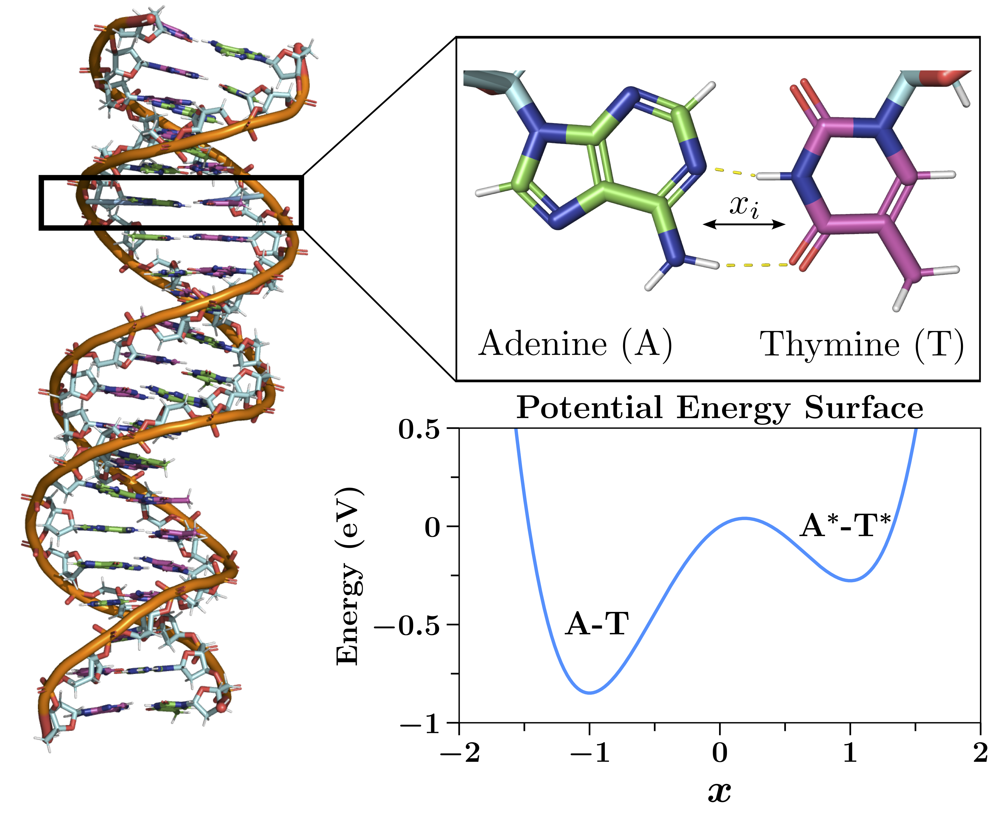
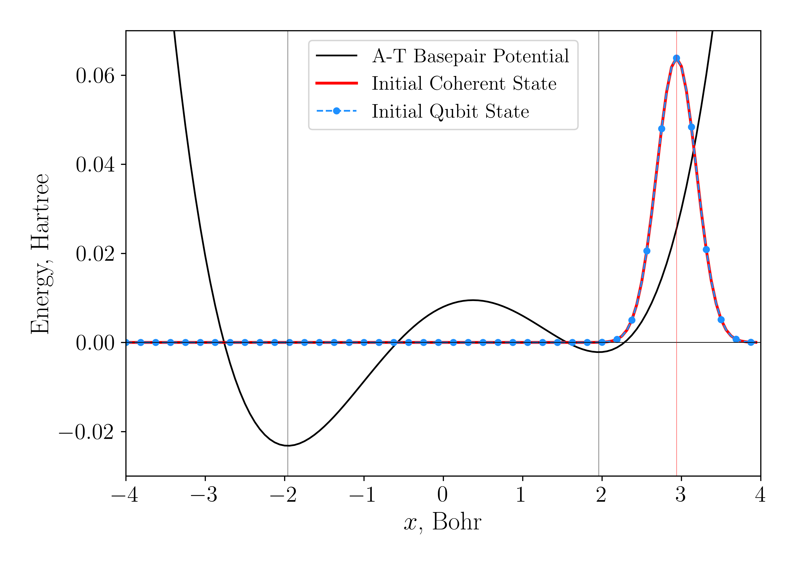
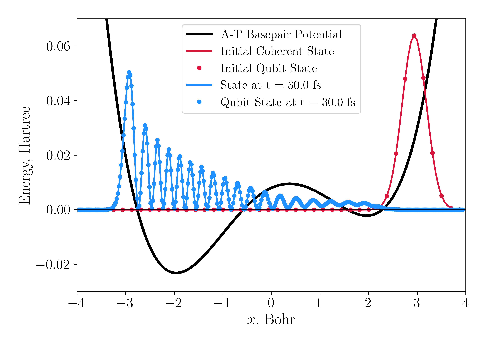
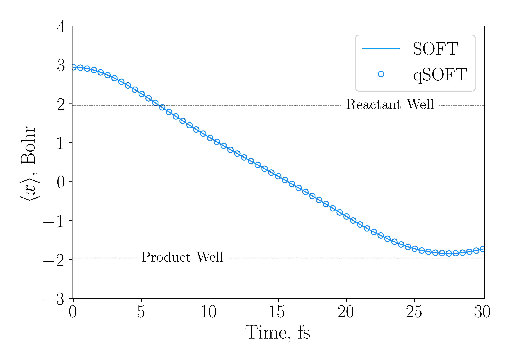

# **Simulation of Proton Transfer Dynamics in Adenine-Thymine Base Pair**

In this section, we will compute the dynamics for the proton transfer in an Adenine-Thymine Base Pair as it would be implemented on a qubit-based quantum computer. We will model the Adenine-Thymine base pair following [this paper](https://pubs.rsc.org/en/content/articlelanding/2015/cp/c5cp00472a). A cartoon schematic of our model is shown here:



## Setting Up The Simulation

We have included the Adenine-Thymine base pair potential as a default quartic potential in `qflux`. It can be implemented with the following code: 

```python

from qflux.closed_systems.utils import get_proton_mass
from qflux.closed_systems import DynamicsCS

x0 = 1.9592 # x_0 scaling factor
omega = 0.00436 # frequency corresponding to right well from V''(x)
proton_mass = get_proton_mass() # Proton mass in a.u.

# Instantiate our class with 128 grid points, initial displacement, mass of proton, and frequency
dw_dyn_obj = DynamicsCS(n_basis=128, xo=1.5*x0, mass=proton_mass, omega=omega)

# Define our coordinate grid range
dw_dyn_obj.set_coordinate_operators(x_min=-4.0, x_max=4.0)
# Initialize operators
dw_dyn_obj.initialize_operators()
# Construct initial state
dw_dyn_obj.set_initial_state(wfn_omega=omega)

# Define the propagation time
total_time = convert_fs_to_au(30.0)
N_steps = 3000
dw_dyn_obj.set_propagation_time(total_time, N_steps)

# Set our hamiltonian as a quartic potential
dw_dyn_obj.set_hamiltonian(potential_type='quartic')
# Propagate
dw_dyn_obj.propagate_qSOFT()
dw_dyn_obj.propagate_SOFT()
dw_dyn_obj.propagate_qt()
```

We can check the initial state by plotting on the potential: 

```python 
import matplotlib.pyplot as plt
fig, ax = plt.subplots()
ax.plot(dw_dyn_obj.x_grid, dw_dyn_obj._PE_grid + 0.008 , '-', color='black', label='A-T Basepair Potential')
ax.plot(dw_dyn_obj.x_grid, np.real(0.04*dw_dyn_obj.psio_grid.conj()*dw_dyn_obj.psio_grid), '--', color='red', label='Initial Coherent State')
ax.plot(dw_dyn_obj.x_grid, np.real(0.04*dw_dyn_obj.dynamics_results_qSOFT[0].conj()*
                                   dw_dyn_obj.dynamics_results_qSOFT[0])/dw_dyn_obj.dx,
        '--o', markevery=3, color='dodgerblue', label='Initial Qubit State')
ax.axhline(0, lw=0.5, color='black', alpha=1.0)
ax.axvline(-dw_dyn_obj.x0, lw=0.5, color='black', alpha=0.5)
ax.axvline(dw_dyn_obj.x0, lw=0.5, color='black', alpha=0.5)
ax.axvline(dw_dyn_obj.x0*1.5, lw=0.5, color='red', alpha=0.5)
ax.set_xlabel('x, Bohr',fontsize=18)
ax.set_ylabel('Energy, Hartree',fontsize=18)We i
ax.tick_params(labelsize=16, grid_alpha=0.5)
plt.ylim(-0.03,0.07)
plt.legend(fontsize=14,loc='upper center')
```

Which should produce a plot like this: 



And we can also visualize with the final propagated state: 

```python

from scipy.interpolate import interp1d
import numpy as np 

x_1024 = np.linspace(dw_dyn_obj.x_grid[0], dw_dyn_obj.x_grid[-1], 1024)
f_interp = interp1d(dw_dyn_obj.x_grid, dw_dyn_obj.dynamics_results_grid[-1], kind='cubic')
fq_interp = interp1d(dw_dyn_obj.x_grid, dw_dyn_obj.dynamics_results_qSOFT[-1], kind='cubic')
rho_interp = f_interp(x_1024)
rho_q_interp = fq_interp(x_1024)

fig, ax = plt.subplots()
ax.plot(dw_dyn_obj.x_grid, dw_dyn_obj._PE_grid + 0.008,
        '-',color='black',label='A-T Basepair Potential', lw=3)
ax.plot(dw_dyn_obj.x_grid, 0.04*np.real(dw_dyn_obj.psio_grid.conj()*dw_dyn_obj.psio_grid),
        '-',color='crimson',label='Initial Coherent State', lw=1.8)
ax.plot(dw_dyn_obj.x_grid, np.real(0.04*dw_dyn_obj.dynamics_results_qSOFT[0].conj()*
                                   dw_dyn_obj.dynamics_results_qSOFT[0])/dw_dyn_obj.dx,
        'o', markevery=3, color='crimson', label='Initial Qubit State')

ax.plot(x_1024, 0.04*np.real(rho_interp.conj()*rho_interp),'-',color='dodgerblue', 
        label=f'State at t = {convert_au_to_fs(total_time)} fs', lw=1.8)
ax.plot(x_1024, 0.04*np.real(rho_q_interp.conj()*rho_q_interp)/dw_dyn_obj.dx,'o',color='dodgerblue', 
        label=f'Qubit State at t = {convert_au_to_fs(total_time)} fs', lw=0, markevery=3)

ax.axhline(0, lw=0.5, color='black', alpha=1.0)
ax.set_xlabel('$x$, Bohr',fontsize=18)
ax.set_ylabel('Energy, Hartree',fontsize=18)
ax.tick_params(labelsize=16, grid_alpha=0.5)
plt.ylim(-0.03,0.07)
plt.xlim(-4, 4)
plt.legend(fontsize=14,loc='upper center')
```



And we can also look at the expectation value of the position as a function of time: 

```python
from qflux.closed_systems.utils import calculate_expectation_values, convert_au_to_fs

avxgrid = calculate_expectation_values(dw_dyn_obj.dynamics_results_grid, dw_dyn_obj.x_grid)
qb_x = calculate_expectation_values(dw_dyn_obj.dynamics_results_qSOFT, dw_dyn_obj.x_grid, dx=1)

fig, ax = plt.subplots()
ax.plot(dw_dyn_obj.tlist*convert_au_to_fs(1.), avxgrid, '-', color='dodgerblue',label=r'SOFT')
ax.plot(dw_dyn_obj.tlist*convert_au_to_fs(1.), qb_x, 'o', markevery=50, 
        color='dodgerblue',label=r'qSOFT', lw=0, fillstyle='none', ms=6)
ax.axhline(-x0, ls='--', lw=0.5, color='black', alpha=0.5)
ax.axhline( x0, ls='--', lw=0.5, color='black', alpha=0.5)
plt.text(20, x0-0.1, 'Reactant Well', fontsize = 16, backgroundcolor='white')
plt.text(5, -x0-0.1, 'Product Well', fontsize = 16, backgroundcolor='white')
ax.set_xlabel(r'Time, fs')
ax.set_ylabel(r'$\left\langle x \right\rangle$, Bohr')
ax.tick_params(grid_alpha=0.5)
plt.ylim(-3,4)
plt.xlim(-.10, 30.1)
plt.legend(loc='upper right')
```



We can see that we have good agreement between the expectation values computed from the qubit dynamics and the classical grid-based dynamics. 

Lastly, we can visualize the evolution over time and see that the dynamics are nearly identical: 

<video controls src="../../images/Part_I/Basepair-Wavepacket-Animation.mp4"></video>

**Note:** We can visualize the quantum circuit behind the evolution for a single time-step: 

```python
dw_dyn_obj.quantum_circuit.draw('mpl', fold=-1)
```

And get a nice simplified diagram for the quantum circuit: 


But, in order to get an actual idea for how complex the circuit is, we should first call the `.decompose()` method, which will break things up into fundamental gates. The resulting circuit is massive (I'll let you see for yourself!):

```python
dw_dyn_obj.quantum_circuit.decompose(reps=1).draw('mpl', fold=-1)
```

You can increase the number of `reps` repetitions that the circuit will be decomposed to further decompose the circuit. Here, we're just going to highlight that the number of non-local gates (those involving at least 2 qubits) is greater than 3000 - far more than we can reasonably run on current NISQ devices. 
