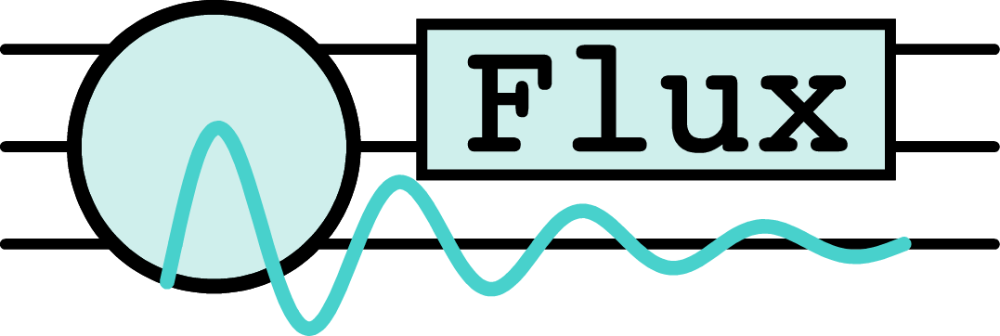

# Closed Systems Documentation and User Guide

This section includes documentation and tutorials focused on illustrating the usage and versatility of the `qflux.closed_systems` module. 

## Overview

In this section, we outline the main functionality of the `closed_systems` module. 

First, we will provide some conceptual explanations that provide the user with a necessary background to understand the code. Then we provide some illustrative examples that demonstrate how the code can be used. Finally, we provide the source code as an API reference to the source code.

## Examples and Introductory Concepts 

Before we look at doing Quantum Dynamics on a quantum computer, we'll start out by looking at some ways that we can do quantum dynamics on a classical computer! This is an important step as it will familiarize you with the general ingredients of a quantum dynamics simulation and will also provide us with a means of validating the results obtained from a quantum computer.

- [Anatomy of a Dynamics Simulation](basics.md)
- [Example: Quantum Harmonic Oscillator](qho_example.md)
- [API Documentation](cs_api.md)
