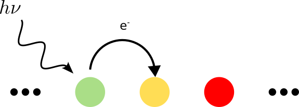
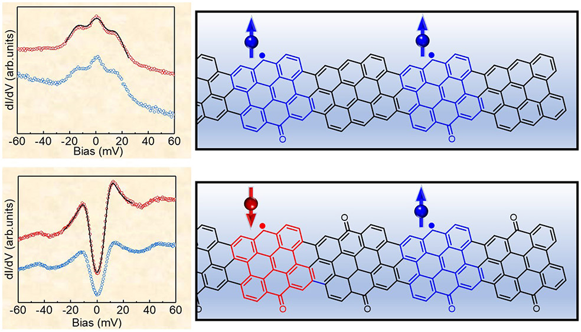

# **Simulation of a Spin-Chain System**

## Motivation

This section demonstrates the practical considerations for perfoming dynamical evolution of an Hamiltonian written in the basis of Pauli matrices using a qubit-based quantum computer framework. The chosen Hamiltonian can be used to describe the chemical process of electron transfer across a chromophore chain, with the onsite parameters describing the strength of the electronic affinity at each chromophore and off-site couplings describing the barrier for transferring an electron between adjacent sites.



A problem of practical interest that could be modelled by this method would be a functionalized graphene nanoribbon, where alternating sites contain radical character ([Nano Lett. 2022, 22, 1, 164–171](https://pubs.acs.org/doi/10.1021/acs.nanolett.1c03578)).



The stability of the radical character at each site can be described by the on-site parameter ($\Omega _n$) and the coupling between sites ($J _{n,n+1}$) governed by the properties of the linker regions containing the diketone groups. These parameters can be tuned by synthetic design of each component part of the nanoribbon.

\begin{align}
H=  \sum_{n=0}^{N-1} \hbar \Omega _n \sigma_n ^z - \dfrac{1}{2} \sum_{n=0}^{N-2} \big(J_{n,n+1}^x \hat{\sigma}_{n}^x \hat{\sigma}_{n+1}^x + J_{n,n+1}^y \hat{\sigma}_{n}^y \hat{\sigma}_{n+1}^y + J_{n,n+1}^z \hat{\sigma}_{n}^z \hat{\sigma}_{n+1}^z \big)
\end{align}

Protocol for Hamiltonian evolution in a quantum computer framework:

1.   Construct Hamiltonian operator (sum of tensor product of Pauli matrices)
2.   Construct Trotter approximation of time-evolution operator ($e^{-i\hat{H}t}$)
3.   Construct circuit corresponding to time-evolution operator
4.   Construct circuit for initial state
5.   Combine the initial state and time-evolution circuits
6.   Execute combined circuit
7.   Measure final state
8.   Computing observables with Hadamard test (correlation function and observables)

## Model Hamiltonian and Parameters

Here we use as an example the Hamiltonian for the Heisenberg model, defined as follows:

\begin{align}
H=  \sum_{n=0}^{N-1} \hbar \Omega _n \sigma_n ^z - \dfrac{1}{2} \sum_{n=0}^{N-2} \big(J_{n,n+1}^x \hat{\sigma}_{n}^x \hat{\sigma}_{n+1}^x + J_{n,n+1}^y \hat{\sigma}_{n}^y \hat{\sigma}_{n+1}^y + J_{n,n+1}^z \hat{\sigma}_{n}^z \hat{\sigma}_{n+1}^z \big)
\end{align}

where the coupling elements are described in terms of the $\sigma _x, \sigma _y, \sigma _z$ (Pauli X, Y and Z) matrices with a coupling associated with each type of interaction term for each site/pair of sites. We consider the following parameters, as used in the publication [Non-Markovian decay beyond the Fermi Golden Rule: Survival Collapse of the polarization in spin chains.](https://arxiv.org/pdf/quant-ph/0511176v2.pdf)(but with reduced number of spin sites):

\begin{align}
    N &= 3 \\
    \hbar \Omega _0 &= 0.65 \\
    \hbar \Omega _n &= 1.0, \; n > 0 \\
    J_{0,1}^x = J_{1,0}^y &= 0.75 \\
    J_{n,n+1}^x = J_{n,n+1}^y &= 1.0, \; n > 0  \\
    J_{n,n+1}^z &= 0, \; \forall n \\
\end{align}

for a chain of $N=3$ spins and an initial state with the first spin up, $| \uparrow \rangle = \begin{bmatrix} 1 \\ 0 \end{bmatrix}$, and the remaining spins down, $| \downarrow \rangle = \begin{bmatrix} 0 \\ 1\end{bmatrix}$.
Although the dynamics of this Hamiltonian can be simulated in a classical computer, we could also use quantum computer to simulate this same problem. One way to do so is by harnessing Qiskit, a python library containing functions that ease the simulation of the problem in quantum device framework.

## Statevector Simulation

```python
from qflux.closed_systems.spin_propagators import * 
from qflux.closed_systems.hamiltonians import * 
from qflux.closed_systems.spin_dynamics_oo import * 

num_q = 3
evolution_timestep = 0.1
n_trotter_steps = 1
hamiltonian_coefficients = [[0.75 / 2, 0.75 / 2, 0.0, 0.65]] + [[0.5, 0.5, 0.0, 1.0]
                            for _ in range(num_q - 1)]
initial_state = "011"  # Specify the initial state as a binary string

csimulation = SpinDynamicsS(
                            num_q,
                            evolution_timestep,
                            n_trotter_steps,
                            hamiltonian_coefficients
                            )
csimulation.run_dynamics(nsteps=250, state_string=initial_state)
csimulation.save_results(f"{num_q}_spin_chain")
csimulation.plot_results(f"{num_q}_spin_chain_statevector")

```

## Quantum Circuit Simulation with Hadamard Test

```python
num_q = 3
evolution_timestep = 0.1
n_trotter_steps = 1
hamiltonian_coefficients = [[0.75 / 2, 0.75 / 2, 0.0, 0.65]] + [[0.5, 0.5, 0.0, 1.0]
                            for _ in range(num_q - 1)]
initial_state = "011"  # Specify the initial state as a binary string

qsimulation = SpinDynamicsH(
                            num_q,
                            evolution_timestep,
                            n_trotter_steps,
                            hamiltonian_coefficients
                            )
qsimulation.run_simulation(state_string=initial_state, total_time=25, num_shots=100)
qsimulation.save_results('hadamard_test')
qsimulation.plot_results('hadamard_test')
```

